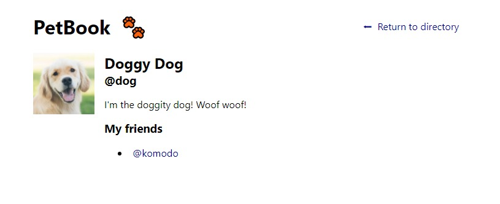

# PetBook

A simple social network for pets. You can view a pet’s profile (which contains their name, bio, and friend list)
and navigate to other profiles. There is also a profile directory where you can see all of the profiles.

## Screenshot

### Homepage

### Profile Page

## Technology Used

- HTML
- CSS
- JavaScript (ReactJs)

## Source

&copy; [Codecademy.com](https://codecademy.com) 2022.
